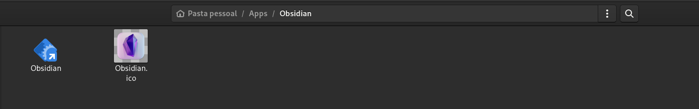
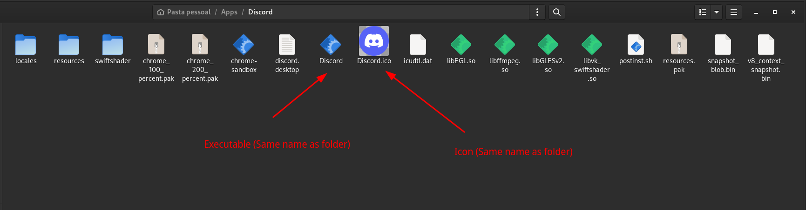
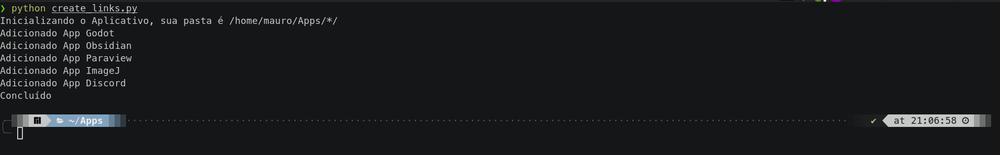

# Create-Linux-App-Link

A quick python program to create link entries for AppImages in Linux. Basically it creates a entry inside your menu/rofi with icons. It can automate the create of links for all your applications, with simple steps.

## Usage

1. You just have to download this `create_links.py` file and put it inside your home directory with the name `Apps`.

2. Then you can download whatever standalone application that you want > create a Folder with the application name > put your downloaded programs inside the folder > Then define the executable as the same name as the folder name that you choose.


It's not necessary to copy all the binaries of the applications to the Apps folder, if you want, you can just make a shortcut and put it inside the Apps/{AppName} folder (AppName is the application that you want to create a link).



If you want to add an icon, just put the file with the same name as the AppName and .ico extension inside the app folder, and it'll just detect automatically.



And then, just run in your terminal (Inside the Apps folder):
```bash
python create_links.py
```



This will create a menu entrie for all folders that you've made. Congrats \o/
